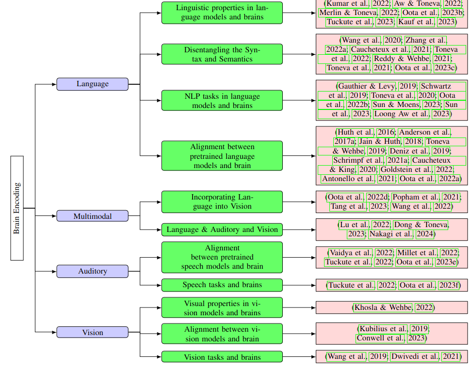

# Reading List for Topics in Deep Learning for Brain Encoding and Decoding
By [Subba Reddy Oota](https://subbareddy248.github.io/) (subba-reddy.oota@inria.fr), [Mnemosyne Team](https://team.inria.fr/mnemosyne/team-members/), [Inria](https://www.inria.fr/fr), at Bordeaux, Inria, France, and [Brain Cognition and Computation Lab](https://sites.google.com/view/bccl-iiith/home?authuser=0), at IIIT-Hyderabad, India. If there are any areas, papers, and datasets I missed, please let me know!

## Recent Content

[Visio-Linguistic Brain Encoding](https://openreview.net/forum?id=TEKnz3B1jGF)

## Table of Contents

* [Survey Papers](#survey-papers)
* [Brain Encoding](#brain-encoding)
  * [Linguistic Encoding](#linguistic-encoding)
  * [Visual Encoding](#visual-encoding)
  * [Auditory Encoding](#auditory-encoding)
  * [Video Encoding](#video-encoding)
  * [Multi-modal Encoding](#Multi-modal-encoding)
* [Brain Decoding](#brain-decoding)
  * [Linguistic Decoding](#linguistic-decoding)
  * [Visual Decoding](#visual-decoding)
  * [Auditory Decoding](#auditory-decoding)
  * [Video Decoding](#video-decoding)
* [Workshops](#workshops)
* [Tutorials](#tutorials)
* [Courses](#courses)
* [Datasets](#Datasets)
  * [Movies](#Movies)

# Research Papers

## Survey Papers

[When Computational Representation Meets Neuroscience: A Survey on Brain Encoding and Decoding](https://www.ijcai.org/proceedings/2021/0594.pdf), IJCAI 2021
[Deep Neural Networks and Brain Alignment: Brain Encoding and Decoding (Survey)](https://arxiv.org/abs/2307.10246)

# Deep Learning for Brain Encoding and Decoding

## Brain Encoding

###  Brain Encoding Survey Tree
Fig 9 in our survey paper [Deep Neural Networks and Brain Alignment: Brain Encoding and Decoding (Survey)](https://arxiv.org/abs/2307.10246).

    

###  Linguistic Encoding
1. **Instruction-tuning Aligns LLMs to the Human Brain** `preprint`

    *Khai Loong Aw, Syrielle Montariol, Badr AlKhamissi, Martin Schrimpf, and Antoine Bosselut.* [[PDF](https://arxiv.org/pdf/2312.00575.pdf)] Arxiv 2023,  

[Scaling laws for language encoding models in fMRI](https://arxiv.org/abs/2305.11863), NeurIPS 2023 [[code]](https://github.com/HuthLab/encoding-model-scaling-laws/tree/main)

[Joint processing of linguistic properties in brains and language models](https://arxiv.org/pdf/2212.08094.pdf), NeurIPS 2023 [[code]](https://github.com/subbareddy248/lingprop-brain-alignment)

[Training language models to summarize narratives improves brain alignment](https://arxiv.org/pdf/2212.10898.pdf), ICLR 2023 [[code]](https://github.com/awwkl/brain_language_narratives)

[Long-Term Plausibility of Language Models and Neural Dynamics during Narratives Listening](https://drive.google.com/file/d/1Ua19A8fT_4BJxSNHKdOw5H6e7__WacWz/view?usp=sharing), Cogsci 2022

[Neural Language Taskonomy: Which NLP Tasks are the most Predictive of fMRI Brain Activity?](https://drive.google.com/file/d/1GXUscjrmcU5jUzFP5vLixgMEqHw4_TBO/view), NAACL 2022

[Can fMRI reveal the representation of syntactic structure in the brain?](https://openreview.net/pdf?id=fCjd2bXG5iI), NeurIPS 2021 [[code]](https://github.com/anikethjr/brain_syntactic_representations)

[CogniVal: A Framework for Cognitive Word Embedding Evaluation](https://aclanthology.org/K19-1050.pdf), CoNLL 2019 [[code]](https://github.com/DS3Lab/cognival)

[The neural architecture of language: Integrative reverse-engineering converges on a model for predictive processing](https://www.biorxiv.org/content/10.1101/2020.06.26.174482v2.full.pdf), PNAS 2021 [[code]](https://github.com/mschrimpf/neural-nlp/tree/master/ressources)

[Disentangling Syntax and Semantics in the Brain with Deep Networks](https://arxiv.org/pdf/2103.01620.pdf), ICML 2021 [[slides]](https://icml.cc/media/icml-2021/Slides/9271_rcXwrEs.pdf)

[Modeling task effects on meaning representation in the brain via zero-shot MEG prediction](https://arxiv.org/pdf/2009.08424.pdf), NeurIPS 2020 [[code]](https://github.com/otiliastr/brain_task_effect), [[slides]](https://drive.google.com/file/d/1-q7R3a0jxH_zE6of7aD4at6NgviyCZW8/view)

[Interpreting and improving natural-language processing (in machines) with natural language-processing (in the brain)](https://arxiv.org/pdf/1905.11833.pdf), NeurIPS 2019 [[code]]( https://github.com/mtoneva/brain_language_nlp)

[Inducing brain-relevant bias in natural language processing models](https://arxiv.org/pdf/1911.03268.pdf), NeurIPS 2019 [[code]](https://github.com/danrsc/bert_brain_neurips_2019)

[Incorporating Context into Language Encoding Models for fMRI](https://proceedings.neurips.cc/paper/2018/file/f471223d1a1614b58a7dc45c9d01df19-Paper.pdf), NeurIPS 2018

[Aligning context-based statistical models of language with brain activity during reading](https://aclanthology.org/D14-1030/), EMNLP 2014

### Visual Encoding

[Brain-Like Object Recognition with High-Performing Shallow Recurrent ANNs](https://proceedings.neurips.cc/paper/2019/file/7813d1590d28a7dd372ad54b5d29d033-Paper.pdf), NeurIPS 2019

[Neural Taskonomy: Inferring the Similarity of Task-Derived Representations from Brain Activity](https://proceedings.neurips.cc/paper/2019/file/f490c742cd8318b8ee6dca10af2a163f-Paper.pdf), NeurIPS 2019

### Auditory Encoding

[Speech language models lack important brain-relevant semantics](https://arxiv.org/pdf/2311.04664.pdf) Arxiv

[Meg encoding using word context semantics in listening stories](https://hal.science/hal-04148324/), Interspeech 2023 [[code]](https://github.com/subbareddy248/MEG_Encoding)

[Speech Taskonomy: Which Speech Tasks are the most Predictive of fMRI Brain Activity?], Interspeech 2023 [[code]](https://github.com/BCCL-IIITH/Speech-Taskonomy)

[Self-supervised models of audio effectively explain human cortical responses to speech](https://proceedings.mlr.press/v162/vaidya22a/vaidya22a.pdf), ICML 2022

[The Hierarchical Cortical Organization of Human Speech Processing](https://www.jneurosci.org/content/jneuro/37/27/6539.full.pdf), Journal of Neuroscience 2016

### Video Encoding

[How the Human Brain Makes Sense of a World in Motion](https://arxiv.org/ftp/arxiv/papers/2104/2104.13714.pdf), CCN 2021 [[code]](http://algonauts.csail.mit.edu/challenge.html)

### Multi-Modal Encoding

[Brain encoding models based on multimodal transformers can transfer across language and vision](https://arxiv.org/abs/2305.12248), Arxiv 2023

[Interpreting Multimodal Video Transformers Using Brain Recordings](https://openreview.net/pdf?id=p-vL3rmYoqh), ICLR 2023 (Multimodal Representation Learning Workshop)

## Brain Decoding

### Linguistic Decoding

[Brain2Word: Decoding Brain Activity for Language Generation](https://arxiv.org/pdf/2009.04765.pdf), [[code]](https://github.com/nicolaffETHZ/Brain2Word_paper)

[Does injecting linguistic structure into language models lead to better alignment with brain recordings?](https://openreview.net/forum?id=9y4qOAIfA9r)), [[code]](https://github.com/mhany90/Structural_bias_brain)

[Linking artificial and human neural representations of language](https://aclanthology.org/D19-1050.pdf), EMNLP 2019, [[code]](https://github.com/hans/nn-decoding)

[Towards sentence-level brain decoding with distributed representations](https://ojs.aaai.org/index.php/AAAI/article/view/4685/4563), AAAI 2019

[Toward a universal decoder of linguistic meaning from brain activation](https://www.nature.com/articles/s41467-018-03068-4), Nature Communications 2018

### Visual Decoding

[From voxels to pixels and back: Self-supervision in natural-image reconstruction from fMRI](https://proceedings.neurips.cc/paper/2019/file/7d2be41b1bde6ff8fe45150c37488ebb-Paper.pdf), NeurIPS 2019 [[code]](https://github.com/WeizmannVision/ssfmri2im)

[Reconstructing Perceived Images from Human Brain Activities with Bayesian Deep Multi-view Learning](https://ieeexplore.ieee.org/document/8574054), IEEE TNNLS 2018

### Auditory Decoding

[Towards reconstructing intelligible speech from the human auditory cortex](https://www.nature.com/articles/s41598-018-37359-z), Nature Scientific Reports 2019 [[code]](http://naplab.ee.columbia.edu/naplib.html)

### Video Decoding

[Decoding the Semantic Content of Natural Movies from Human Brain Activity](https://www.frontiersin.org/articles/10.3389/fnsys.2016.00081/full), Frontiers 2016

# Workshops

# Tutorials
[Deep Learning for Brain Encoding and Decoding](https://cognitivesciencesociety.org/wp-content/uploads/2022/04/Paper-ID-1271-cogsci22a-sub1271-i10.pdf), Subba Reddy Oota, Cogsci 2022 [[code]](https://github.com/jashna14/DL4Brain)

[Encoding and Decoding Speech From the Human Brain](https://www.youtube.com/watch?v=aM6N7aTUJxI), Edward Chang, ICML 2021

# Slides

[Reconstructing Speech from Human Auditory Cortex](http://www.cs.toronto.edu/~lex/notes/CSC2518-presentation.pdf)

# Courses

# Datasets

### Movies
[UC Berkeley](https://berkeley.app.box.com/s/l95gie5xtv56zocsgugmb7fs12nujpog/folder/142176642528)

[Short Clips](https://gin.g-node.org/gallantlab/shortclips/src/master)

### Listening and Reading Same Stories
[UC Berkeley](https://berkeley.app.box.com/v/Deniz-et-al-2019/folder/91887116790?page=1)

### Listening Stories
[Narratives](https://datasets.datalad.org/?dir=/labs/hasson/narratives)

[The Moth Radio Hour]

### Multi-Modal 

[Movies and Stories](https://berkeley.app.box.com/s/l95gie5xtv56zocsgugmb7fs12nujpog)

